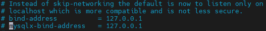

# Linux虚拟机

## 1 虚拟机配置

| 主机   | IP             |
| ------ | -------------- |
| Host   | 172.31.151.10  |
| Node 1 | 172.31.147.169 |
| Node 2 | 172.21.72.105  |
| Node 3 | 172.21.70.154  |


### 1.1 虚拟机访问

除了常规的ssh访问外，对于Host主机，上面配置了code-server，可以通过网页访问vscode的服务器版。

code-server的安装和使用[方法](https://github.com/cdr/code-server/blob/main/docs/guide.md)，使用时直接使用命令code-server在前台开启服务，如果要配置访问ip，用户名和密码等，可以配置文件~/.config/code-server/config.yaml。常用的配置如下：

~~~yaml
bind-addr: 0.0.0.0:8080 # 使用0.0.0.0意思是可以从其它主机访问，如果只允许本地访问，设置为：127.0.0.1
auth: password
password: 12345
cert: false
~~~

使用systemctl在后台启动code-server

~~~shell
sudo systemctl restart code-server@$USER
~~~


### 1.2 已配置的环境

每台主机上都配置了java环境，版本是openjdk 16。

* Host主机上配置MySQL服务

> Linux上安装MySQL：直接使用apt安装mysql-server即可，安装后自动启动，可以使用systemctl status mysql.service查看运行的状态。
>
> systemctl是Linux服务管理的一种形式，另一种是service，具体可以参考[博客](https://blog.csdn.net/skh2015java/article/details/94012643)、[阮一峰](https://www.cnblogs.com/zwcry/p/9602756.html)，或者官方介绍


### 1.3 Hyper-V ping主机
> https://www.cnblogs.com/staneee/p/6879842.html


## 2 VMware虚拟机

* 开放VMware虚拟机的端口，供宿主机访问，[参考](https://www.jianshu.com/p/7d324275a52d)

  这种方式是增加虚拟机和宿主机端口之间的映射，使得可以通过宿主机之外的机器能够通过开放的端口访问虚拟机。

* 修改MySQL的配置文件，修改bind-address和mysqlx-bind-address，将其删除或改为0.0.0.0意为监听所有的IP，不限于本机IP

> 配置文件地址：
>
> /etc/mysql/my.cnf
>
> /etc/mysql/mysql.conf.d/mysql.cnf



之后重启mysql服务

> sudo /etc/init.d/mysql restart


## Linux常用操作

> ~~~ bash
> systemctl enable server		# 运行server开机启动
> 
> systemctl stop server		# 停止开机启动
> ~~~

> ```bash
> service rabbitmq-server start	# 开启服务
> service rabbitmq-server stop	# 关闭服务
> service rabbitmq-server status	# 查看服务状态
> ```

> 开机启动脚本
>
> 1. 执行的sh脚本
> 2. 放到/etc/profile.d/下，并添加执行权限

> ~~~shell
> # 生成ssh密钥对
> ssh-keygen -t rsa -C "ssh-key description"
> ~~~
>
> 
