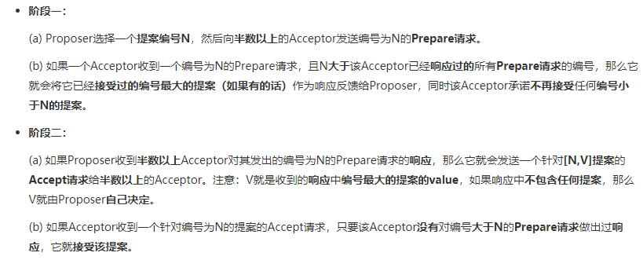
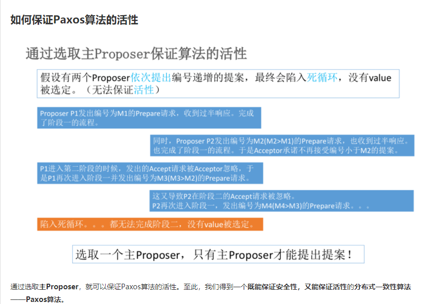

# 分布式

## 分布式常见概念

### 分布式一致性

#### Paxos算法 博客参考:[1](https://www.cnblogs.com/linbingdong/p/6253479.html)   [2](https://zhuanlan.zhihu.com/p/31780743)

> Paxos算法解决的是分布式一致性问题，即一个分布式系统中的各个进程如何就某个值（决议）达成一致。

> Paxos算法是基于消息传递且具有高度容错特性的一致性算法，是目前公认的解决分布式一致性问题的最有效的算法之一。

##### Paxos算法中三者角色

* Proposer	提议者
* Acceptor     决策者
* Learners     学习者

> 具体的实现中，一个进程可以同时充当多种角色

> 一个重要的概念

* 提案 Proposal

> 安全性的定义

* 只有被提出的Value才能被选定
* 只有一个Value被选定
* 如果某个进程任务某个Value被选定了，那么这个Value必须是真的被选定的那个

> 两个约束

* P1： 一个Acceptor必须接受它收到的第一个提案
  * P1a：一个Acceptor只要尚**未响应过**任何**编号大于N**的**Prepare请求**，那么他就可以**接受**这个**编号为N的提案**
  * 规定：一个提案被选定需要被半数以上的Acceptor接受
* P2：如果某个Value为V的提案被选定了，那么每个编号更高的被选定提案的Value必须也是V
  * P2a：如果某个Value为V的提案被选定了，那么每个编号更高的被Acceptor接受的提案的Value必须也是V
  * P2b：如果某个Value为V的提案被选定了，那么之后任何Proposer提出的编号更高的提案的Value也必须是V
  * P2c：对于任意的N和V，如果提案[N, V]被提出，那么存在一个半数以上的Acceptor组成的集合S，满足以下两个条件中的任意一个：
    * S中每个Acceptor都没有接受过编号小于N的提案
    * S中Acceptor接受过的最大编号的提案的value为V

##### Paxos算法的两个阶段

##### 如何保证Paxos算法的活性

## CAP理论

https://blog.csdn.net/yeyazhishang/article/details/80758354

* 一致性 Consistency

* 可用性 Availability

* 分区容错性 Partition Tolerance

***

# NGINX [官网](http://nginx.org/en/linux_packages.html)

