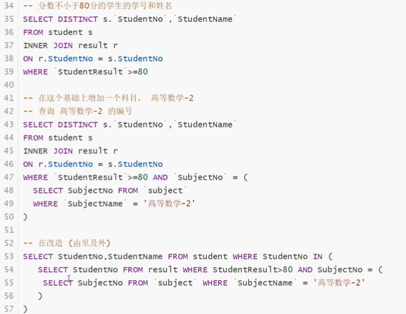

# 数据库


## 数据库的分类


## Redis

### Redis入门

> Redis是什么？
>
> Redis（Remote Dictionary Server），远程字典服务！

> Redis能做什么？
>
> 1. 内存存储、持久化。（RDB、AOF）
> 2. 效率高，用于告诉缓存
> 3. 发布订阅系统
> 4. 地图信息分析
> 5. 计时器、计数器

> 特性
>
> 1. 多样的数据类型
> 2. 持久化
> 3. 集群
> 4. 事务

> 学习中需要用到的东西
>
> 1. 官网（http://www.redis.io)
> 2. 中文网（http://www.redis.cn)
> 3. Github


* Redis可以用在数据库、缓存和消息中间件MQ

* Redis支持的数据结构

  ### 五种数据类型

  > String、Hash、List、Set、Sorted Set

  ####  String

  通过set命令存储，append可以在当前key对应的value后面追加
  
  ~~~ shell
  set key value	# 设置键值
  get key			# 获取值
  append key other_value	# 追加键值
  del key			# 删除键值
  getset key		# 获取键值，并设置新值
  strlen key		# 计算String型键值的长度
  setex key sec value # 设置键值，并设置过期时间为sec
  setnx key value # 如果该key有值，则不写入。【在分布式锁中经常使用！】
  setrange key offset value	# 对于字符串，从offset开始向后替换为新的值，遇到结尾，继续向后。
  getrange key 0 3		# 截取字符串[0,3]
  getrange key 0 -1		# 和get key一样
  mset k1 v1 k2 v2	# 同时设置多个key值
  mget key1 key2	# 批量获取KEY值
  msetnx k1 v1 k2 v2	# msetnx是一个原子操作，要么一起成功，要么一起失败。
  getset key value	# 如果存在值，获取原来值，并设置新的值
  ############################################################################
  set对象
  set user {name:zhangsan,age:3}
  mset user:1:name zhangsan user:1:age 3
  ~~~
  
  对Integer的操作。可以对键值进行加减。
  
  ~~~shell
  incr key		# 自加键值
  incrby key n	# 键值加n
  decr key		# 自减键值
  decrby key n	# 键值减n
  ~~~


#### List（列表）

> 基本的数据类型，可以用list实现栈、队列、阻塞队列！List可以看做是一个双向链表。

> 所有的list命令都是用**l**开头

~~~shell
lpush list value		# 在列表的左边添加值
rpush list value		# 在列表的右边添加值
lpop					# 在首部移除元素
rpop					# 在尾部移除元素
lrange list start stop	# 获取列表中一个范围的值
lindex list pos			# 通过下表获取某一个值
llen list				# 获取列表中元素的个数，或者说长度
lrem list count value	# 移除列表中指定的元素，完全匹配，列表中可以有重复值，所以可以移除多个。
ltrim list start stop	# 修剪指定位置的元素，执行后，列表中仅剩下start到stop的元素
rpoplpush source des    # 从source弹出一个元素并将它放到des中
lset list index value	# 设置list中index位置的元素为value
linsert list before|after pivot value # 在列表中的pivot元素的前面或后面插入value，如果指定的pivot有重复，则匹配第一个出现的元素。

~~~

#### Set（集合）

> set的值不能有重复，无序不重复。

~~~shell
sadd set member		# 向Set中添加一个值，如果不存在则创建
smembers set		# 查看set中所有的元素
sismember set mem	# 查看set中存不存在元素mem
scard set			# 获取set中所有元素的个数
srem set mem		# 移除set中的元素mem
srandmember set		# 从set中随机抽选出一个元素
spop set			# 随机删除一个元素
smove s1 s2 mem		# 将一个指定的值mem从s1中移动到另外一个集合中s2
#######################################################################
数字集合类：
 - 并集	sinter
 - 差集	sdiff
 - 交集	sunion
 sdiff s1 s2	# 列出s1中不属于s2中的元素
 sinter	s1 s2	# s1和s2中的交集
 sunion s1 s2	# s1和s2的并集
~~~


#### Hash（哈希）

> Map集合，key-value的形式存储，本质和String没有太大区别，还是一个简单的key-value
>
> Hash更适合于对象的存储，String更适合存储字符串。

~~~shell
hset hash field value		# 在hash中的field中设置值value
hget hash field				# 获取hash中的field的值
hgetall hash				# 获取hash中所有的值
hmset hash field1 value field2 value	# 同时设置hash中的多个key值
hmget hash field1 field2				# 同时获取多个key值
hsetnx hash field value		# 如果不存在则可以设置，存在则不可以设置
hdel hash field 			# 删除hash中指定的key字段
hlen hash		# 获取hash中的key的个数
hexists hash field # 判断hash中是否存在field
hkeys hash		# 获取hash中所有的key
hvals hash 		# 获取hash中所有的value
~~~


#### Zset （有序集合）

> 在set的基础上，增加了一个值

~~~shell
zadd myset 1 value	# 给有序集合myset中添加多个值，并设置序号
zrange myset 0 -1	# 输出myset中所有的元素，元素已经是排序后的，升序输出。0 -1是指的位置
zrangebyscore myset min max # 在[min，max]的区间上排序
zrevrange myset 0 -1	# 输出myset中从大到小的元素，降序输出
zrevrangebyscore myset max min	# 降序输出
zcard myset		# 获取集合中的个数
zrem myset value	# 删除myset中的元素
zcount myset min max	# 统计myset中[min,max]之间的元素个数
~~~

案例思路：排名表、排行表。

* Zset的底层数据结构是[跳表](https://zhuanlan.zhihu.com/p/68516038)

  * 跳表是对有序链表查询的一个优化
  * 跳表查询的时间复杂度为O(log(n)

  

### 三种特殊数据类型

#### geospatial 地理空间

朋友的定位、附近的人、打车距离计算等等


~~~shell
geoadd key logitude latitude member		# 地图中添加一个位置
geopos member		# 获取位置的经纬度信息
geodist member1 member2		# 获取两个地点的直线距离
georadius key logitude latitude radius unit		# 获取某一个经纬度附近的位置
georadiusbymember key member radius unit		# 找出位于指定元素周围的位置
geohash key member	# 将member的经纬度转换为一维的字符串，如果两个字符串越接近，那么距离越近！

geosearch
geosearchstore
~~~

> GEO底层的实现原理其实就是Zset！我们可以使用Zset命令来操作GEO！

~~~shell
zrange key 0 -1		# 输出geospatial中所有的地理位置
zrem key value		# 删除一个地理位置
~~~


#### Hyperloglog

> 什么是基数？基数统计算法

优点：占用的内存是固定的，2^64不同的元素的基数，只需要12KB内存。

~~~shell
pfadd key a b c a d			# 添加元素
pfcount key					# 统计基数，比如当前的个数为4
pfmerge key key1 key2		# 合并key1和key2到key中
~~~

如果允许有容错，可以使用Hyperloglog，有0.81%的错误率！

如果不允许出错，就是用set或者自己的数据类型即可！


#### Bitmaps

> 位存储

使用二进制位来记录，只有0和1两个状态。

~~~shell
setbit key offset value		# 设置位图中的某个bit值
getbit key offset			# 获取某个位置的bit值
bitcount key start stop		# 统计[start stop]中位为1的个数
~~~


### Redis常用命令

~~~shell
ping			# 检查连接是否成功，成功返回pang
set key value	# 设置键值
get key			# 获取值
keys *			# 查看所有的键值
exists key		# key是否存在
select 3		# 选择数据库3
dbsize			# 数据库大小
flushdb			# 清空当前数据库
flushall		# 清空所有的数据库
expire key second	# 设置key值过期时间
ttl key			# 查询key的剩余时间
type key		# 查看key的类型
move key index		# 将key移动到数据库index中，Redis默认有16个数据库
config set value	# 设置配置文件里的值
config get variable	# 获取配置文件里的值
auth “*****”	# 验证密码
~~~

### 事务

Redis事务：本质是一组命令的集合！一个事务中的所有命令都会被序列化，在事务的执行过程中，会按照顺序执行！

一次性、顺序性、排他性~

* Redia没有隔离级别的概念！所有的命令在事务中，并没有直接被执行，只有在发起执行命令的时候才会执行。

* Redis单条命令保证原子性的，但是事务不保证原子性。

> 事务

1. 开启事务
2. 命令入队
3. 执行事务

> 正常执行事务！

~~~shell
mutil		# 开启一个事务
set k1 v1
set k2 v2
get k2
exec		# 执行一个事务
#############################################
discard		# 放弃事务
~~~

> 如果事务里面的命令有异常

* 如果语法有问题，命令添加失败，则所有事务都不会被执行。

  ~~~shell
  multi
  set k1 v1
  get k1
  set k2
  set k3 v3
  exec
  # 报错，所有命令不执行
  ~~~

  

* 如果在运行时报错，语法没有问题，则只有该条命令出错，其它命令正常执行

  ~~~shell
  1. set k1 hello
  2. multi
  3. incr k1
  4. set k2 v2
  5. get k2
  6. exec
  # 事务会执行，只有第3行执行会出错，其它命令正常执行
  ~~~

  > 监控！（面试常问）

* **悲观锁：**
  * 很悲观，任务什么时候都会出问题，无论做什么都会加锁！

* **乐观锁**
  
  * 很乐观，认为什么时候都不会出问题，所以不会上锁！更新数据的时候判断一下，在此期间是否有人修改过数据。
  *  获取version
  * 更新的时候比较version

> Redis的监视测试

使用watch当做redis的乐观锁操作！

~~~shell
set money 1000
set out 1
watch money
multi
decr money
incr out
exec		# 比对监视的值是否发生变化，如果发生变化了，不执行。执行时自动unwatch
# 正常执行成功
~~~

~~~shell
######### 线程一 #########
watch money		# 监视money的值，获取当前money的值
multi
decr money
incr out
exec

######## 线程二 ##########
decr money		# 在线程一里exec执行之前操作money
~~~


### Redis的配置

> redis.conf

1. Redis对大小写不敏感

2. 可以通过include包含多个配置文件

3. 网络配置，包括绑定的IP，端口等。

4. 通用设置GENERAL

    *  是否守护进程形式运行
    *  日志文件
    *  默认的数据库数量

5. 快照

   

   * 持久化，在规定的时间内，执行了多少次操作，则会持久化到文件.rdb、.aof

     ~~~shell
     # 如果在3600秒内，有一个key被修改，则记录到持久化文件中
     save 3600 1
     save 300 100
     save 60 10000
     ~~~

   * 持久化文件

     ~~~shell
     rdbcompression yes		# 是否压缩rdb文件
     rdbchecksum yes			# 保持rdb时，进行错误的检查校验
     dbfilename dump.rdb		# rdb文件的名字
     dir ./					# rdb文件保存的路径
     ~~~

   * 触发机制
     1. save的规则满足的情况下，会触发RBD规则
     2. 执行flushall命令，也会产生rdb文件
     3. 退出redis，也会产生rdb文件
   * 优点： 
     1. 适合大规模的数据恢复
     2. 对数据的完整性要求不高
   * 缺点：
     1. 需要一定的时间间隔触发，如果Redis意外宕机了，则最后一次修改的数据就丢失了！
     2. fork进程的时候，会占用一定的内存空间！

6. 复制，REPLICATION，主从复制。

7. 限制CLIENT

   ~~~shell
   maxclient 100		# 最大的连接数
   maxmemory <bytes>	# redis的最大容量
   maxmemory-policy noeviction	# 内存到达上限之后的处理策略
   
   # MAXMEMORY POLICY: how Redis will select what to remove when maxmemory
   # is reached. You can select one from the following behaviors:
   #
   volatile-lru # Evict using approximated LRU, only keys with an expire set. -> 只对设置了过期时间的key进行LRU
   allkeys-lru # Evict any key using approximated LRU. -> 删除lru算法的key
   volatile-lfu # Evict using approximated LFU, only keys with an expire set. -> 只对设置了过期时间的key进行lru
   allkeys-lfu # Evict any key using approximated LFU. -> 删除lfu算法的key
   volatile-random # Remove a random key having an expire set. -> 随机删除即将过期的key
   allkeys-random # Remove a random key, any key. -> 随机删除
   volatile-ttl # Remove the key with the nearest expire time (minor TTL) -> 删除即将过期的
   noeviction # Don't evict anything, just return an error on write operations. -> 用不过期，返回错误。
   ~~~

   > 删除策略：
   >
   > * LRU：Least Recently Used，最近最少使用
   > * LFU：Least Frequently Used，最近最不常用  

8. APPEND ONLY模式

   ~~~shell
   appendonly no	# 默认不开启AOF模式，使用RDB的方式持久化。
   # The name of the append only file (default: "appendonly.aof")
   appendfilename "appendonly.aof"
   
   # appendfsync always	# 每次修改都会sync，消耗性能
   appendfsync everysec	# 每秒执行一次sync
   # appendfsync no		# 不同步
   ~~~

append only工作的流程


~~~shell
# 如果AOF文件有损坏，这个时候Redis是启动不起来的，我们需要修复这个文件。
# 使用redis-check-aof修复AOF文件
redis-check-aof --fix appendonly.aof
~~~

优点：

 	1. 每一次修改都同步，文件的完整性会更好！
 	2. 每秒同步一次，可能会丢失一秒的数据
 	3. 从不同步时，效率更高

缺点：

	1. 相对于数据文件来说，AOF远远大于RDB，修复的速度也比rdb慢！
	2. AOF运行效率比RDB要慢。


9. 其它常用配置

   ~~~shell
   logfile /var/log/redis/redis-server.log			# redis-server启动时的日志保持地址
   ~~~


### Redis发布订阅

Redis发布订阅（pub/sub）是一种消息通信模式：发送者（pub）发送消息，订阅者（sub）接受消息。微信、微博、关注系统|

Redis客户端可以订阅任意数量的频道。


> 命令


~~~shell
# 客户端一，订阅客户端
subscribe channel1		# 监听channel1推送的信息

# 客户端二，发布客户端
publish channel1 messge	# 发布消息message到频道channel1
~~~

> 原理

Redis发布订阅的机制，在pubsub.c中实现，可以参考源码。

通过subscribe订阅了频道后，redis-server里维护了一个字典，字典的键是一个个频道，字典的值是一个链表，链表中保持了所有订阅这个channel的客户端，subscribe命令的关键，就是将客户端添加到给定频道的订阅链表中。

通过publish向订阅者发送消息，redis-server会使用给定的频道作为键，在它所维护的频道字典中查找记录了订阅这个频道的所有客户端的链表，遍历这个链表，将消息发布给所有订阅者。

使用场景：

1. 实时消息系统！
2. 实时聊天
3. 订阅、关注系统

稍微复杂的场景我们就会使用消息中间件MQ


### Redis主从复制

#### 概念

主从复制，指将一台Redis服务器的数据，复制到其他的Redis服务器。前者称为主节点（Master/Leader），后者称为从节点（Slave/Follower）。数据的复制是单向的，只能由主节点复制到从节点。

~~~shell
info replication	# 查看主机和从机的情况
####################################################
127.0.0.1:6379> info replication
# Replication
role:master
connected_slaves:0
master_failover_state:no-failover
master_replid:e0c1d2d05d5d464aafcf04f0fedd7b108851fbc1
master_replid2:0000000000000000000000000000000000000000
master_repl_offset:0
second_repl_offset:-1
repl_backlog_active:0
repl_backlog_size:1048576
repl_backlog_first_byte_offset:0
repl_backlog_histlen:0
####################################################
slaveof IP:Port		# 配置从机	
~~~


#### 环境配置

只配置从库，不用配置主库！

~~~shell
# 配置文件需要修改的地方
1. port
2. logfile
3. dump.rdb
3. pidfile
~~~

使用命令配置从机

~~~shell
slaveof IP:Port		# 配置从机	
~~~

真实的配置是在配置文件里进行永久化配置

> 细节

1. 主机可以写，从机不能写只能读。
2. 主机断开连接，从机依旧连接到主机，但是没有写操作了。主机如果回来了，从机依旧可以直接获取到主机的写信息。
3. 如果是使用命令行来配置的主从，如果重启从机了就会变回主机。再次配置后就会立马从主机拿数据。

> 复制原理


> 链式配置

从机依然被配置为另一个从节点的主节点，但是它本身依然是一个从节点。

> 主机挂掉之后

~~~shell
# 对于从机而言，使用命令将自己设置为主机
slaveof no one
~~~

### 哨兵模式

> 概念


多哨兵模式


> 测试

1. 哨兵的配置文件sentinel.conf

   ~~~shell
   sentinel monitor myredis 127.0.0.1 6379 1
   ~~~

   ~~~shell
   44139:X 30 May 2021 15:53:22.626 * monotonic clock: POSIX clock_gettime
                   _._
              _.-``__ ''-._
         _.-``    `.  `_.  ''-._           Redis 6.2.3 (00000000/0) 64 bit
     .-`` .-```.  ```\/    _.,_ ''-._
    (    '      ,       .-`  | `,    )     Running in sentinel mode
    |`-._`-...-` __...-.``-._|'` _.-'|     Port: 26379
    |    `-._   `._    /     _.-'    |     PID: 44139
     `-._    `-._  `-./  _.-'    _.-'
    |`-._`-._    `-.__.-'    _.-'_.-'|
    |    `-._`-._        _.-'_.-'    |           https://redis.io
     `-._    `-._`-.__.-'_.-'    _.-'
    |`-._`-._    `-.__.-'    _.-'_.-'|
    |    `-._`-._        _.-'_.-'    |
     `-._    `-._`-.__.-'_.-'    _.-'
         `-._    `-.__.-'    _.-'
             `-._        _.-'
                 `-.__.-'
   
   44139:X 30 May 2021 15:53:22.627 # Sentinel ID is 19c3601378285e3ecd0b7dede3eac54d42740402
   44139:X 30 May 2021 15:53:22.627 # +monitor master myredis 127.0.0.1 6379 quorum 1
   44139:X 30 May 2021 15:53:22.628 * +slave slave 127.0.0.1:6381 127.0.0.1 6381 @ myredis 127.0.0.1 6379
   44139:X 30 May 2021 15:53:22.634 * +slave slave 127.0.0.1:6380 127.0.0.1 6380 @ myredis 127.0.0.1 6379
   44139:X 30 May 2021 15:54:21.173 # +sdown master myredis 127.0.0.1 6379
   44139:X 30 May 2021 15:54:21.173 # +odown master myredis 127.0.0.1 6379 #quorum 1/1
   44139:X 30 May 2021 15:54:21.173 # +new-epoch 1
   44139:X 30 May 2021 15:54:21.173 # +try-failover master myredis 127.0.0.1 6379
   44139:X 30 May 2021 15:54:21.179 # +vote-for-leader 19c3601378285e3ecd0b7dede3eac54d42740402 1
   44139:X 30 May 2021 15:54:21.179 # +elected-leader master myredis 127.0.0.1 6379
   44139:X 30 May 2021 15:54:21.179 # +failover-state-select-slave master myredis 127.0.0.1 6379
   44139:X 30 May 2021 15:54:21.256 # +selected-slave slave 127.0.0.1:6380 127.0.0.1 6380 @ myredis 127.0.0.1 6379
   44139:X 30 May 2021 15:54:21.256 * +failover-state-send-slaveof-noone slave 127.0.0.1:6380 127.0.0.1 6380 @ myredis 127.0.0.1 6379
   44139:X 30 May 2021 15:54:21.356 * +failover-state-wait-promotion slave 127.0.0.1:6380 127.0.0.1 6380 @ myredis 127.0.0.1 6379
   44139:X 30 May 2021 15:54:21.886 # +promoted-slave slave 127.0.0.1:6380 127.0.0.1 6380 @ myredis 127.0.0.1 6379
   44139:X 30 May 2021 15:54:21.886 # +failover-state-reconf-slaves master myredis 127.0.0.1 6379
   44139:X 30 May 2021 15:54:21.970 * +slave-reconf-sent slave 127.0.0.1:6381 127.0.0.1 6381 @ myredis 127.0.0.1 6379
   44139:X 30 May 2021 15:54:22.917 * +slave-reconf-inprog slave 127.0.0.1:6381 127.0.0.1 6381 @ myredis 127.0.0.1 6379
   44139:X 30 May 2021 15:54:22.917 * +slave-reconf-done slave 127.0.0.1:6381 127.0.0.1 6381 @ myredis 127.0.0.1 6379
   44139:X 30 May 2021 15:54:22.969 # +failover-end master myredis 127.0.0.1 6379
   44139:X 30 May 2021 15:54:22.969 # +switch-master myredis 127.0.0.1 6379 127.0.0.1 6380
   44139:X 30 May 2021 15:54:22.969 * +slave slave 127.0.0.1:6381 127.0.0.1 6381 @ myredis 127.0.0.1 6380
   44139:X 30 May 2021 15:54:22.969 * +slave slave 127.0.0.1:6379 127.0.0.1 6379 @ myredis 127.0.0.1 6380
   44139:X 30 May 2021 15:54:52.982 # +sdown slave 127.0.0.1:6379 127.0.0.1 6379 @ myredis 127.0.0.1 6380
   
   ~~~

   * 如果发现主机出现问题，哨兵会自动地选择出一个从机作为主机。
   * 如果这个时候主机回来了，主机只能去当从机，服从于当前的主机。

* 优点：
  * 哨兵集群，基于主从复制模式，所有的主从配置优点，它全有！
  * 主从可以切换，故障可以转移，系统的可用性就会更好！
  * 哨兵模式就是主从模式的升级，手动到自动，更加健壮！
* 缺点：
  * Redis不好做在线扩容，集群容量一旦达到上限，在线扩容就十分麻烦！
  * 实现哨兵模式的配置其实非常麻烦，里面有很多选择！

> 哨兵模式的全部配置

~~~shell
# Example sentinel.conf 

# 哨兵sentinel实例运行的端口 默认26379 
port 26379 

# 哨兵sentinel的工作目录 
dir /tmp 

# 哨兵sentinel监控的redis主节点的 ip port 
# master-name 可以自己命名的主节点名字 只能由字母A-z、数字0-9 、这三个字符".-_"组成。 
# quorum 配置多少个sentinel哨兵统一认为master主节点失联 那么这时客观上认为主节点失联了 
# sentinel monitor <master-name> <ip> <redis-port> <quorum> 
sentinel monitor mymaster 127.0.0.1 6379 2

# 当在Redis实例中开启了requirepass foobared 授权密码 这样所有连接Redis实例的客户端都 要提供密码 
# 设置哨兵sentinel 连接主从的密码 注意必须为主从设置一样的验证密码 
# sentinel auth-pass <master-name> <password> 
sentinel auth-pass mymaster MySUPER--secret-0123passw0rd

# 指定多少毫秒之后 主节点没有应答哨兵sentinel 此时 哨兵主观上认为主节点下线 默认30秒 
# sentinel down-after-milliseconds <master-name> <milliseconds> 
sentinel down-after-milliseconds mymaster 30000 

# 这个配置项指定了在发生failover主备切换时最多可以有多少个slave同时对新的master进行同步，
# 这个数字越小，完成failover所需的时间就越长， 但是如果这个数字越大，就意味着越 多的slave因为replication而不可用。 
# 可以通过将这个值设为 1 来保证每次只有一个slave 处于不能处理命令请求的状态。

# sentinel parallel-syncs <master-name> <numslaves> 
sentinel parallel-syncs mymaster 1 

# 故障转移的超时时间 failover-timeout 可以用在以下这些方面： 
#1. 同一个sentinel对同一个master两次failover之间的间隔时间。 
#2. 当一个slave从一个错误的master那里同步数据开始计算时间。直到slave被纠正为向正确的 master那里同步数据时。 
#3.当想要取消一个正在进行的failover所需要的时间。 
#4.当进行failover时，配置所有slaves指向新的master所需的最大时间。不过，即使过了这个超 时，slaves依然会被正确配置为指向master，但是就不按parallel-syncs所配置的规则来了 
# 默认三分钟 # sentinel failover-timeout <master-name> <milliseconds> 
sentinel failover-timeout mymaster 180000

# SCRIPTS EXECUTION #配置当某一事件发生时所需要执行的脚本，可以通过脚本来通知管理员，例如当系统运行不正常时发邮 件通知相关人员。 
#对于脚本的运行结果有以下规则： #若脚本执行后返回1，那么该脚本稍后将会被再次执行，重复次数目前默认为10 
#若脚本执行后返回2，或者比2更高的一个返回值，脚本将不会重复执行。 
#如果脚本在执行过程中由于收到系统中断信号被终止了，则同返回值为1时的行为相同。 
#一个脚本的最大执行时间为60s，如果超过这个时间，脚本将会被一个SIGKILL信号终止，之后重新执 行。
#通知型脚本:当sentinel有任何警告级别的事件发生时（比如说redis实例的主观失效和客观失效等 等），将会去调用这个脚本，这时这个脚本应该通过邮件，SMS等方式去通知系统管理员关于系统不正常 运行的信息。调用该脚本时，将传给脚本两个参数，一个是事件的类型，一个是事件的描述。如果 sentinel.conf配置文件中配置了这个脚本路径，那么必须保证这个脚本存在于这个路径，并且是可执 行的，否则sentinel无法正常启动成功。 
#通知脚本 
# sentinel notification-script <master-name> <script-path> 
sentinel notification-script mymaster /var/redis/notify.sh 

# 客户端重新配置主节点参数脚本 
# 当一个master由于failover而发生改变时，这个脚本将会被调用，通知相关的客户端关于master 地址已经发生改变的信息。 
# 以下参数将会在调用脚本时传给脚本: 
# <master-name> <role> <state> <from-ip> <from-port> <to-ip> <to-port> 
# 目前<state>总是“failover”, 
# <role>是“leader”或者“observer”中的一个。 
# 参数 from-ip, from-port, to-ip, to-port是用来和旧的master和新的master(即旧的 slave)通信的
# 这个脚本应该是通用的，能被多次调用，不是针对性的。 
# sentinel client-reconfig-script <master-name> <script-path> 
sentinel client-reconfig-script mymaster /var/redis/reconfig.sh
~~~

当前社会程序员饱和（初级和中级），但是高级程序员重金难求！

### Redis缓存穿透和雪崩

> 服务的高可用问题

#### 缓存穿透 （缓存中没有）

* 布隆过滤器
* 空对象

#### 缓存击穿 （量太大，缓存过期）

* 热点数据不过期
* 加互斥锁


#### 缓存雪崩

某一段时间，缓存集中过期失效，Redis宕机。


### Redis持久化

Redis是内存数据库，如果不将内存数据存储到磁盘上，那么一旦服务器进程退出，服务器中的数据就会丢失。

在指定的时间间隔内，将内存中的数据集快照写入磁盘中，也就是行话的Snapshot快照，恢复时将快照文件直接读到内存里。

### Jedis

使用Java操作Redis

> Jedis是Redis官方推荐的java连接开发工具！使用Java操作Redis中间件！如果要使用Java操作Redis，那一定要了解Jedis。


#### Redisbenchmark

~~~shell
# redis-benchmark -p 6379

====== SET ======
  100000 requests completed in 0.34 seconds		# 总请求数
  50 parallel clients	# 50个并行客户端
  3 bytes payload		# 每次写3 Byte数据
  keep alive: 1			#使用一个数据库

100.00% <= 0 milliseconds
292397.66 requests per second
~~~


* 数据库的选择，Redis拥有多个数据库，不同数据库存储不同的数据。

  

  ~~~shell
  # 选择不同的数据库
  127.0.0.1:6379> select 3	# 选择数据库3
  OK
  127.0.0.1:6379[3]> dbsize
  (integer) 0
  127.0.0.1:6379> flushdb		# 清除数据库
  127.0.0.1:6379> flushall	# 清空所有的数据库
  ~~~

**为什么Redis会选择6379作为默认的端口号？**

> Redis是单线程的！
>
> Redis是基于内存的操作，CPU不是Redis性能瓶颈，瓶颈是机器的内存和网络带宽，既然可以使用单线程来使用，所以就使用了单线程。
>
> **为什么单线程还那么快？**
>
> 1. 误区1：高性能的服务器一定是多线程的？
> 2. 误区2：多线程（CPU上下文切换）一定比单线程效率高！
>
> 核心原因：Redis是将数据放在内存中的，所以单线程去操作的效率是最高的，多线程会上下文切换，对于内存系统来说，没有上下文切换的效率是最高的，多次读写都是在一个CPU上的。


* 非关系型数据库nosql

  为什么要用Nosql

  大数据时代，一般的数据库无法进行分析处理了，2006年Hdoop发布。

  > 1. 单机MySQL的年代
  >
  >    90年代，一个网站的访问量一般不会太大，单个数据库完全足够！更多的是使用静态网页Html~，服务器没有太大的压力！
  >
  >    这种情况下：整个网站的瓶颈是什么？
  >
  >    1. 数据量太大，一个机器放不下了！
  >    2. 数据的索引（B+ Tree），单表超过300万条，需要建立索引，一个机器的内存存不下。
  >    3. 访问量（读写混合），一个服务器承受不了~
  >
  >    只要出现以上的三者情况之一，就必须要晋级。
  >
  > 2. Memcache（缓存）+ MySQL + 垂直拆分（读写分类）
  >
  >    网站80%的情况都是在读，每次都要查询数据库的话就非常麻烦，减轻数据库压力，使用缓存来保证效率！
  >
  >    发展历程：优化数据结构和索引->文件缓存（IO）->Memcached（当时最热门的技术！）
  >
  > 3. 分库分表+水平拆分+MySQL集群
  >
  >    本质：读 + 写
  >
  >    引擎：
  >
  >    MyISAM：表锁，十分影响效率，高并发下出现严重的锁问题。
  >
  >    Innodb：行锁，每次查数据只锁一行
  >
  >    慢慢的使用分库分表来解决写的压力！MySQL在那个年代推出了表分区！并没有多少公司使用。
  >
  >    MySQL的集群，很好地满足了需求。
  >
  > 4. 如今最近的年代
  >
  >    发生了翻天覆地的变化
  >
  >    MySQL关系型数据库就不够用了，数据量很多，变化很快！
  >
  >    MySQL有的使用用来存储一下比较大的文件，文字、图片、视频等，数据库很大，效率就低了。有一种数据库专门用来处理这种数据。
  >
  >    大数据的IO压力下，表几乎没法更改。
  >
  > 5. 目前一个基本的互联网项目
  >
  >    


> 为什么要用NoSQL

用户的个人信息，社交网络，地理位置。用户自己产生的数据，用户日志等等爆发式增长！

这时候就需要使用NoSQL数据库了，可以很好地处理以上情况。

### 什么事NoSQL

NoSQL = Not Only SQL

关系型数据库：表格，行，列

泛指非关系性数据库，随着web2.0互联网的诞生！传统的关系型数据库很难对付。尤其是超大规模的高并发的社区。NoSQL在大数据环境下发展的十分迅速。Redis是发展最快的，是必须掌握的一个技术。

很多数据的存储，如地理位置、社交网络等，不需要一个固定的格式，不需要多余的操作就可以横向拓展。


> NoSQL特点
>
> 1. 方便扩展，（数据之间没有关系，很好扩展！）
>
> 2. 大数据量高性能（Redis一秒可以写8万次，读取11万。NoSQL的缓存记录，是一种细粒度的缓存，性能会比较高！）
>
> 3. 数据类型是多样型的（不需要事先设计数据库！随取随用！如果数据量十分大的表，很多人就无法设计了！）
>
> 4. 传统RDBMS和NoSQL
>
>    ~~~
>    传统的RDBMS
>    - 结构化组织
>    - SQL
>    - 数据和关系都存在单独的表中
>    - 操作，数据定义语言
>    - 严格的一致性
>    - 基础的事务
>    - ......
>    ~~~
>
>    ~~~
>    NoSQL
>    - 不仅仅是数据
>    - 没有固定的查询语言
>    - 键值对存储，列存储，文档存储，图形数据库
>    - 最终一致性
>    - CAP理论和BASE理论  （异地多活）
>    - 高性能，高可用，高可扩展
>    - ......
>    ~~~

> 了解： 3V + 3高
>
> 大数据时代的3V：主要是描述问题的
>
> 1. 海量Volume
> 2. 多样Variety
> 3. 实时Velocity
>
> 大数据时代的3高：主要是对程序的要求
>
> 1. 高并发
> 2. 高可扩（随时水平拆分）
> 3. 高性能（保证用户体验和性能）

真正在公司中的实践：NoSQL + RDBMS一起使用才是最强的。

关系型数据库管理系统（Relational Database Management System，RDBMS）。


###  阿里巴巴的架构演进


技术急不得，越是慢慢学，才能越扎实！

敏捷开发，极限编程。

未来想当一个架构师：没有什么是加一层解决不了的！

~~~  bash
# 1. 商品的基本信息
 早期关系型数据库就可以解决了！MySQL/Oracle（去IOE）
 淘宝内部的MySQL不是大家用的MySQL
# 2. 商品的描述
 文档型数据库中，MongoDB
# 3. 图片
	分布式文件系统FastDFS
	- 淘宝自己的 TFS
	- Google GFS
	- Hadoop HDFS
	- 阿里云 OSS
# 4. 商品的关键字（搜索）
	- 搜索引擎 solr elasticsearch
	- iSearch 多隆（阿里技术大佬）
# 5. 商品热门的波段信息
	- 内存数据库
	- Redis Tair Memcache
# 6. 商品的支付，外部的支付接口
	- 三方应用
~~~

大型互联网公司的应用问题

* 数据类型太多了！
* 数据源太多，经常重构！

* 数据要改造，大面积改造？


### NoSQL的四大分类

**KV键值对**

* 新浪：Redis
* 美团：Redis + Tair
* 阿里、百度：Redis + Memcache

**文档型数据库（bson格式，和json一样）**

* MongoDB（一般必须要掌握）
  * MongoDB是一个基于分布式文件存储的数据库，C++编写，主要用来处理大量的文档。
  * MongoDB是一个介于关系型数据库和非关系型数据库中间的产品！是NoSQL中功能最丰富，最像关系型数据库的。
* ConthDB

**列存储数据库**

* HBase
* 分布式文件系统

**图关系数据库**

* 不是存图形的，放的是关系，比如：朋友圈设计网格、广告推荐等！
* Neo4j，InfoGrid


活着的意义？追求幸福（帮助他人，感恩之心！），探索未知（努力地学习，不要被社会抛弃！）


## MySQL

### MySQL的安装

[官网](https://dev.mysql.com/doc/refman/8.0/en/binary-installation.html)

或者直接使用APT进行安装


#### 使用Python访问MySQL数据库

* 安装mysqlclient

>  pip install mysqlclient

* 使用

~~~python
import MySQLdb as mysql

# 连接数据库
db = mysql.connect("172.31.149.108", "jesse", "tsjk", "school", charset="utf8")

# 使用cursor()方法获取操作游标 
cursor = db.cursor()

# 使用execute方法执行SQL语句
cursor.execute("SELECT VERSION()")

# 使用 fetchone() 方法获取一条数据
data = cursor.fetchone()

print "Database version : %s " % data

# 关闭数据库连接
db.close()
~~~


#### 允许外网访问MySQL

* 修改MySQL的配置文件，修改bind-address和mysqlx-bind-address，将其删除或改为0.0.0.0意为监听所有的IP，不限于本机IP。如果改为特定的IP地址，意为监听特定的IP。

> 配置文件地址：
>
> /etc/mysql/my.cnf
>
> /etc/mysql/mysql.conf.d/mysql.cnf


之后重启mysql服务

> sudo /etc/init.d/mysql restart


### 数据库分类

#### 关系型数据库

* MySQL、Oracle、Sql Server、DB2、SQLlite
* 通过表和表之间，行和列之间的关系进行数据的存储

#### 非关系型数据库

* Redis、MongoDB
* 非关系型数据库，对象存储，通过对象的属性来存储

#### DBMS（数据库管理系统）

* 数据库的管理软件，管理我们的数据，维护和获取数据。
* MySQL，数据库管理系统


### MySQL常用命令

~~~sql
use database;		-- 选择使用一个数据库
show databases;		-- 显示所有数据库

create database name;	-- 创建一个数据库
create database if not exists name;  -- 如果数据库不存在就创建数据库

drop database dbname;		-- 移除数据库
drop database if exists dbname;  -- 如果存在就删除数据库

drop table tabname -- 移除表
drop table if exists tabname -- 移除表

show tables;	-- 查看数据库中的所有的表

--  单行注释 

/*
 多行注释
*/

-- 添加用户并授权 [亲测可行]https://www.cnblogs.com/xzlive/p/9546964.html
-- 创建用户，并运行所有IP访问
create user 'user'@'%' identified by '123news';
-- 授权用户
grant all privileges on *.* to 'user'@'%';
flush privileges;

-- 重启mysql服务（可选）
systemctl restart mysql

-- 连接一个数据库
mysql -h ip -P port -uroot -ppassword	-- mysql默认端口3306
~~~


* 数据库语言   CRUD增删改查（业务程序员）， CV程序员！  API程序员！

> DDL	定义	Definition
>
> DML	操作	Manipulation
>
> DQL	查询	Query
>
> DCL	控制	Control

#### 数据库的列类型

> 数值


> 字符串


> 时间日期


### 使用SQLyog

#### 安装


> 安装Sqlyog，建议安装早期的版本。

> 连接数据库时，需要使用已授权的用户连接，这样才能拥有完整的访问权限。正常连接，权限正常时会显示当前数据库上所有已创建的数据库。


**连接数据库报错**

~~~shell
# 连接数据库时报错
'Authentication plugin 'caching_sha2_password' cannot be loaded'
# 解决方法：在数据库中执行下述命令，其中用户名、IP、密码换成自己的。
ALTER USER 'root'@'localhost' IDENTIFIED BY 'abc@123' PASSWORD EXPIRE NEVER;
ALTER USER 'root'@'localhost' IDENTIFIED WITH mysql_native_password BY 'abc@123';
FLUSH PRIVILEGES;
~~~

#### 

#### 实际使用

##### 创建表


> 成功后，右键打开表，之后就像编辑excel一样编辑表。


### 索引

#### 索引的分类

> 一个表中，主键索引只能有一个，唯一索引可以有多个

* 主键索引（PRIMARY KEY）
  * 唯一的标识，主键不可重复，只能由一个列作为主键
* 唯一索引（UNIQUE KEY）
  * 避免重复的列出现，可以重复，多个列都可以标识为唯一索引
* 全文索引
  * 特点的数据库引擎上采用，MYISAM
  * 快速定位数据
* 常规索引
  * 默认的，index、key关键字设置

### 数据库的字段属性


* Unsigned
  * 无符号整数
  * 声明该列不能为负数
* zerofil
  * 0填充
  * 不足的位数，使用0填充
* 自增
  * 在上一条记录的基础上加1
  * 通常用来设计唯一的主键
  * 可以自定义设计主键的起始值和步长
* 非空
  * 假设设置为not null，如果不给他赋值，就会报错！
  * NULL，如果不填写，默认就是null！
* 默认
  * 设置默认值


~~~sql
-- 创建表
CREATE TABLE IF NOT EXISTS `student` (
	`id` INT(4) NOT NULL AUTO_INCREMENT COMMENT '学号', 
	`name` VARCHAR(30) NOT NULL DEFAULT '佚名' COMMENT '姓名',
	`gender` VARCHAR(10) NOT NULL DEFAULT '男' COMMENT '性别',
	`birthday` DATETIME DEFAULT NULL COMMENT '出生日期',
	`address` VARCHAR(100) DEFAULT NULL COMMENT '家庭住址',
	PRIMARY KEY(`id`)
)ENGINE=INNODB DEFAULT CHARSET=utf8

SHOW CREATE DATABASE school		-- 查看创建数据库的命令

SHOW CREATE TABLE student		-- 查看创建表的命令

DESC student	-- 显示表的结构

-- 数据库引擎
/*
INNODB	默认使用
MYISAM	早期版本
*/
~~~

| -          | MYISAM | INNODB        |
| ---------- | ------ | ------------- |
| 事务支持   | 不支持 | 支持          |
| 数据行锁定 | 不支持 | 支持          |
| 外键约束   | 不支持 | 支持          |
| 全文索引   | 支持   | 不支持        |
| 表空间大小 | 较小   | 较大，约为2倍 |

>  常规使用操作

* MYISAM	节约空间，速度较快
* INNODB     安全性高，事务的处理，多表多用户操作

>  在磁盘上的存储格式

* Ubuntu上MySQL的配置文件为mysqld.cnf

~~~shell
[mysqld]
pid-file        = /var/run/mysqld/mysqld.pid	# 
socket          = /var/run/mysqld/mysqld.sock	#
datadir         = /var/lib/mysql				# 数据库文件存储在磁盘上的位置
log-error       = /var/log/mysql/error.log		#
~~~

* 一个数据库对应一个文件夹，文件夹名即为数据库名，路径在datadir指定的路径下
* 一个表对应一个**.idb**文件，文件名即为表名

> 修改表

~~~sql
ALTER TABLE student RENAME AS student_info		-- 重命名表

ALTER TABLE student MODIFY `name` VARCHAR(10)	-- 修改表字段的约束

ALTER TABLE student CHANGE `id` `ID` INT(3)		-- 修改表的字段名

DROP TABLE IF EXISTS student	-- 如果存在表student则删除
~~~


### MySQL数据管理

#### 外键

> 方式一，在创建的时候添加约束

~~~sql
CREATE TABLE `grade` (
	`gradeID` INT(10) NOT NULL AUTO_INCREMENT COMMENT '年级ID',
	`gradename` VARCHAR(50) NOT NULL COMMENT '年级名称',
	PRIMARY KEY (`gradeID`)
)ENGINE=INNODB DEFAULT CHARSET=utf8


-- 学生表的gradeID字段要去引用年级表的gradeID
-- 定义外键key
-- 给外键添加约束（执行引用）
CREATE TABLE IF NOT EXISTS `student` (
	`id` INT(4) NOT NULL AUTO_INCREMENT COMMENT '学号', 
	`gradeID` INT(10) NOT NULL COMMENT '学生的年级',
	`name` VARCHAR(30) NOT NULL DEFAULT '佚名' COMMENT '姓名',
	`gender` VARCHAR(10) NOT NULL DEFAULT '男' COMMENT '性别',
	`birthday` DATETIME DEFAULT NULL COMMENT '出生日期',
	`address` VARCHAR(100) DEFAULT NULL COMMENT '家庭住址',
	PRIMARY KEY(`id`),
	KEY `FK_gradeID` (`gradeID`),
	CONSTRAINT `FK_gradeID` FOREIGN KEY (`gradeID`) REFERENCES `grade` (`gradeID`)
)ENGINE=INNODB DEFAULT CHARSET=utf8
~~~

删除表的时候，必须先删除有外键引用的表

> 方式二，创建表之后，通过ALTER添加外键

~~~~sql
ALTER TABLE `student`
ADD CONSTRAINT `FK_gradeID` FOREIGN KEY (`gradeID`) REFERENCES `grade` (`gradeID`);
~~~~


### 事务

#### 什么是事务

将一组SQL放在一个批次中执行~


> 事务原则：ACID

* 原子性（Atomicity）

  * 针对一个事务，要么一起成功，要么一起失败

* 一致性（Consistency）

  * 针对一事务操作前与操作后的状态一致

* 隔离性（Isolation）

  * 脏读
    * 一个事务读取了另一个事务未提交的数据
  * 不可重复读
    * 在一个事务内读取表中的某一行数据，多次读取的结果不同
  * 幻读（虚读）
    * 在一个事务内读取到了别的事务插入的数据，导致前后读取不一致

* 持久性（Durability）

  * 事务结束后的数据不随着外界原因导致数据丢失

  

### MySQL索引学习


#### 聚簇索引&非聚簇索引

* 是否是聚簇索引取决于索引和数据是否放在一起


* MySQL表中有几个索引
  * 至少一个，InnoDB有一个聚簇索引，若干个非聚簇索引。
  * 回表
    * select * from table where name=zhangsan
    * 先根据name查询id，再根据id查询整行的记录，走了2棵B+树，这种现象叫做回表
  * 索引覆盖
    * select id,name from table where name=zhangsan
    * 根据name可以直接查询到id,name两个列的值，直接返回即可，不需要从聚簇索引中查询数据，此时叫做索引覆盖
  * 最左匹配
    * 组合索引，索引name和age
    * select * from table where name=? and age=?
  * 索引下推
    * select * from table where name=? and age=?
    * 在没有索引下推之前：先根据name从存储引擎中获取符合规则的数据，然后再server层对age进行过滤
    * 有索引下推之后：根据name，age两个的条件来从存储引擎中获取对应的数据


### MySQL数据管理

#### DML语句

##### 添加

~~~
-- insert into 表名 (字段1, 字段2, ...) value ('值1', '值2', ...)
~~~


##### 删除

~~~sql
-- delete from 表名 where ...
delete from student where id = 1

-- truncate 清空一张表 
truncate table student

~~~

> truncate和delete的区别

* 都删除数据，不会删除表结构
* truncate重新设置自增列，计数器会归零
* truncate不会影响事务


##### 修改

~~~sql
-- update 表名 set column_name=value,[column_name=value, ...] where ...
update student set `name`='hi' where id = 1
~~~

~~~sql
-- 修改表的结构
alter table student add score int(3)
~~~


##### 查询

###### DQL查询数据（Data Query Language）

* 所有的查询都是用select

~~~sql
select * from student	-- 查找所有

select `id` from student	-- 查找某个字段

select `id` as 学号 from student as s		-- 查找字段并起别名

select concat('学号： ', `id`) as 学号 from student WHERE `name` LIKE '邱%'

select distinct `Name` from student

select 1*2+2+4/1 as 计算结果	-- 表达式
select version()	-- 函数
select @@auto_increment_increment	-- 步长
~~~

* where条件子句

  * 逻辑运算符

  | 预算符      | 描述 |
  | ----------- | ---- |
  | AND &&      | 与   |
  | OR \|\|     | 或   |
  | NOT ！      | 非   |
  | BETWEEN AND | 区间 |

  ~~~sql
  SELECT `id` AS 学号, `name` AS 名字 FROM student WHERE `score` > 80 AND `score` < 90
  
  SELECT `id` AS 学号, `name` AS 名字 FROM student WHERE `score` BETWEEN 70 AND 90
  ~~~

  

  * 模糊查询

  | 预算符      | 语法              | 描述                  |
  | ----------- | ----------------- | --------------------- |
  | IS NULL     | a is null         | a为null               |
  | IS NOT NULL | a is not null     | a不为null             |
  | BETWEEN     | a between b and c | a位于b和c之间         |
  | LIKE        | a like b          | a匹配b                |
  | IN          | a in (a1, a2,..)  | a在a1,a2...其中的一个 |

  ~~~sql
  select `id` from student `name` like '刘%'	-- 匹配姓刘的同学
  select `id` from student `name` like '刘_'	-- 匹配姓刘的双字同学
  ~~~

  

#### 联表查询

##### 7种join查询方式


##### 使用方法

~~~sql
SELECT * FROM A INNER|LEFT|RIGHT JOIN B ON condition
~~~


* inner join

  ~~~sql
  SELECT s.Name FROM student AS s
  INNER JOIN Chengjibiao b
  ON s.id = b.id;
  ~~~

* left join

  ~~~sql
  SELECT s.`name`, o.`id` FROM student AS s
  LEFT JOIN otherStudent AS o
  ON s.`name` = o.`name`
  -- left join把左边的表全部输出
  ~~~

* right join

  ~~~sql
  SELECT s.`name`, o.`id` FROM student AS s
  RIGHT JOIN otherStudent AS o
  ON s.`name` = o.`name`
  -- right join
  ~~~

| 操作       | 描述                                     |
| ---------- | ---------------------------------------- |
| inner join | 如果表中至少有一个匹配，就返回行         |
| left join  | 从左表中返回所有的值，即使右表中没有匹配 |
| right join | 从右表中返回所有的值，即使左表中没有匹配 |

* 复合运用

~~~ sql
SELECT s.`name`, o.`id` FROM student AS s
RIGHT JOIN otherStudent AS o
ON s.`name` = o.`name`
inner join `result` res
on res.`name` = o.`name`
~~~

* 自连接

  > 原始表


> 查询结果


#### 分页和排序

* 排序

~~~sql
-- 排序：升序 ASC； 降序 DESC
-- order by 根据某个字段排序
SELECT `id` AS 学号, `name` AS 名字 FROM student 
WHERE `score` > 80 AND `score` < 90 
ORDER BY `id` DESC;
~~~

* 分页

~~~sql
-- 缓解数据库压力， 瀑布流
-- 分页，每页只显示若干条语句
-- limit start, count  从start开始显示，每页显示count数量
SELECT `id` AS 学号, `name` AS 名字 FROM student 
WHERE `score` > 80 AND `score` < 90 
ORDER BY `id` DESC
limit 0,5	-- 第一页
			-- 第二页 5, 5
~~~


#### 子查询

> 本质：在where语句中添加一个查询语句




### 数据库的三大范式

#### 为什么需要数据规范化

* 重复数据
* 更新异常
* 插入异常
* 删除异常

#### 三大范式

##### 第一范式

> 要求数据库的每一列都是不可分割的原子数据项


##### 第二范式

>前提： 满足第一范式
>
>确保数据库表中的每一列都和主键相关，而不能只与主键的某一部分相关


##### 第三范式

> 前提： 满足第一和第二范式
>
> 每一列数据都和主键直接相关，而不能间接相关

##### 规范性和性能的问题

关联查询的表不能超过3个

* 考虑商业化的需求和目标，数据库的性能更加重要
* 在规范性问题的时候，需要适当地考虑规范性
* 故意给单表增加一些冗余的字段，从多表查询变为单表查询
* 估计增加一些计算列，从大数据量降低为小数据量的查询：索引

### 自定义函数

~~~sql
-- 编写函数

-- 1. 创建表
CREATE TABLE `app_user` (
	`id` BIGINT(20) UNSIGNED NOT NULL AUTO_INCREMENT,
	`name` VARCHAR(50) DEFAULT '' COMMENT 'user name',
	`email` VARCHAR(50) NOT NULL,
	`phone` VARCHAR(20) NOT NULL,
	`gender` TINYINT(4) UNSIGNED DEFAULT '0' COMMENT '0 male; 1 female',
	`password` VARCHAR(100) NOT NULL COMMENT 'password',
	`age` TINYINT(4) DEFAULT '0',
	`create_time` DATETIME DEFAULT CURRENT_TIMESTAMP,
	`update_time` DATETIME DEFAULT CURRENT_TIMESTAMP ON UPDATE CURRENT_TIMESTAMP,
	PRIMARY KEY (`id`)
)

-- 2. 插入数据
DELIMITER $$ -- 自定义函数
CREATE FUNCTION mock_data(in_count INT)
RETURNS INT DETERMINISTIC	-- 需要添加 DETERMINISTIC，
BEGIN
	DECLARE i INT DEFAULT 0;
	
	WHILE i < in_count DO
		INSERT INTO `app_user` (`name`, `email`, `phone`, `gender`, `password`, `age`) 
		VALUE (CONCAT('user_', FLOOR(RAND() * 99999999) + 1000000), 
               CONCAT(FLOOR(RAND() *  9999999999) + 100000000, '@qq.com'), 
			   CONCAT('1', FLOOR(RAND() *  9999999999) + 100000000), 
               FLOOR(RAND() * 2), UUID(), FLOOR(RAND() * 100));
		SET i = i + 1;
	END WHILE;
	RETURN i;
END;

SELECT mock_data(1000000);

TRUNCATE `app_user`

SELECT `name` FROM app_user WHERE `name` = 'user_76523082'

CREATE INDEX `id_app_user_name` ON `app_user`(`name`)
~~~

### MySQL的备份

为了防止重要的数据不丢失，使用备份。

>  备份的方式

* 直接拷贝物理文件

* 在Sqlyog等可视化工具上手动导出

* 使用命令mysqldump在命令行导出

  ~~~shell
  # 导出
  mysqldump -hlocalhost -P3306 -uroot -ppsd database table > bk.sql
  # 导入 登录数据库后使用
  sql > source bk.sql
  # 导入 命令行
  mysql -uuser -ppsd 库名 < bk.sql
  ~~~

  


### 使用JDBC

#### 第一个JDBC程序

~~~java
package mysql;

import java.sql.*;

public class jdbc {
    public static void main(String[] args) throws ClassNotFoundException, SQLException{
        // 1. 加载驱动
        Class.forName("com.mysql.cj.jdbc.Driver"); // 固定写法，加载驱动

        // 2. 用户信息
        String url = "jdbc:mysql://192.168.223.128:3306/school?useUnicode=true&character=utf8&useSSL=true";
        String username = "jesse";
        String password = "tsjk";
        // 3. 连接
        Connection connection = DriverManager.getConnection(url, username, password);
        // 4. 执行SQL的对象
        Statement statement = connection.createStatement();
        // 5. 执行SQL的对象，执行SQL语句
        String sql = "SELECT `name` FROM app_user WHERE `name` = 'user_76523082'";
        ResultSet result = statement.executeQuery(sql);

        while (result.next()) {
            System.out.println("name: " + result.getObject("name"));
        }
        // 6. 释放
        result.close();
        statement.close();
        connection.close();
    }
}
~~~


## 线程池

* 线程池解决什么问题
  * 任务处理
  * 阻塞IO
  * 线程创建和销毁的开销
  * 管理线程
  * **异步解耦(最主要的作用)**
* 线程池的组成
  * 执行队列，多个线程，
  * 任务队列，多个任务
  * 管理组件


# RPC：远称过程调用

参考博客：[简书](https://www.jianshu.com/p/7d6853140e13)

### 1.1 基本概念

RPC（Remote Procedure Call）远程过程调用，简单点理解就是一个节点请求另一个节点提供服务。

## 微服务架构

介绍的比较全面详细的文章[微服务架构是什么？](https://www.zhihu.com/question/65502802)

Go架构实践	——毛剑

* 单体架构

  尽管也是模块化逻辑，但是最终它还是会打包并部署为单体式应用。太复杂，以至于任何单个开发者都不可能搞懂它。它无法扩展，可靠性很低，最终，敏捷性开发和部署变得无法完成。


* 微服务起源

  SOA(面向服务)的架构，微服务可以想象为SOA的一种实践。K8S，KVM

  1. 小即是美：小的服务代码少，bug少，易测试，易维护，也更容易不断迭代完善的精致进而美妙。

  2. 单一职责：一个服务也只需要做好一件事，专注才能做好。

  3. 尽可能早地创建原型：尽可能早地提供服务API，建立服务契约，达成服务间沟通的一致性约定，至于实现和完善可以慢慢再做。

  4. 可移植性比效率更重要

     

* 微服务定义

  1. 原子服务，服务关注单一业务，	 服务间采用轻量级的通信机制
  2. 独立进程
  3. 隔离部署
  4. **去中心化服务治理**

  缺点：基础设施的建设、负责度高。

* 微服务不足

  "There are no siler bullets"

  微服务应用是分布式系统，由此会带来固有的复杂性。开发者不得不使用RPC或者消息传递，来实现进程间通信；此外，必须要写代码来处理消息传递中速度过慢或者服务不可用等局部失效问题。网络扇出，到下游呈100X放大。服务调用可以使用batch调用，批量调用。串行调用改为并行调用。

  分区的数据库架构，同时更新多个业务主体的事务很普遍。这种事务对于单体式应用来说很容易，因为只有一个数据库。  分布式一致性。

  测试一个基于微服务架构的应用也是很复杂的任务。

  服务模块间的依赖，应用的升级有可能会波及多个服务模块的修改。

  对运维基础设施提出更高的要求。

* 组件服务化

  ESB（企业服务总线）：指的是传统[中间件技术](https://baike.baidu.com/item/中间件技术/10430164)与[XML](https://baike.baidu.com/item/XML/86251)、[Web](https://baike.baidu.com/item/Web/150564)服务等技术结合的产物

  1. kit：一个微服务的基础库（框架）

  2. service：业务代码+kit依赖+第三方依赖组成的业务微服务

  3. rpc+message queue（kafka）：轻量级通讯

     本质上等同于多个微服务组合完成一个完整的用户场景。

* 按业务组织服务

  大前端（移动/WEB）=》网关接入=》业务服务=》平台服务=》基础设施（PaaS/SaaS）

  

* 去中心化

  1. 数据去中心化，每个服务独占一个DB，一个redis
  2. 治理去中心化，流量变大之后，会出现流量热点，全局的热点
  3. 技术去中心化，收敛语言

* 基础设施自动化

  无自动化不微服务，自动化包括测试和部署。

  1. CICD: Gitlab + Gitlab Hooks + k8s
  2. Testing: 测试环境、单元测试、API自动化测试
  3. 在线运行时：k8s，以及一系列Prometheus、ELK、Control Panle

* **可用性 & 兼容性设计**

  可用性很重要，也是大厂面试时常考的知识点。

  著名的Design For Failure思想，微服务架构采用粗粒度的进程间通信，引入了额外的复杂性和需要处理的新问题，如网络延迟、消息格式、负载均衡和容错，忽略其中任何一点都属于对“分布式计算的误解”。

  * 隔离
  * 超时控制
  * 负载保护
  * 限流
  * 降级
  * 重试
  * 负载均衡

  发送时保守，接受时要开放。

  ## 微服务设计

  


* API Gateway

  按照垂直功能进行了拆分，对外暴露了一批微服务，但是因为缺乏统一的出口面临了不少困难。

  * 客户端到微服务直接通信，强耦合。因为对外网暴露，很难做大规模的重构。
  * 需要多次请求，客户端聚合数据，工作量巨大，延迟高。
  * 协议不利于统一，各个部门间有差异，需要端来兼容。
  * 面向“端”的API适配，耦合到了内部服务。
  * 多终端兼容逻辑复杂，每个服务都需要处理。
  * 统一逻辑无法收敛，比如安全认证、限流。


新增了一个app-interface用于统一的协议出口，在服务内进行大量的dataset join，按照业务场景来设计粗粒度的API，给后续服务的演进带来很多优势。

* 轻量交互：协议精简、聚合
* 差异服务：

最致命的故障是单点故障（Single point of failure）


* Microservice划分

 通过业务职能（Business Capability）或是DDD的界限上下文（Bounded Contex）。

业务职能：由不同部门提供的职能

DDD：界限上下文是DDD中用来划分不同业务边界的元素，这里业务边界的含义是“解决不同业务问题”的问题域和对应的解决方案域。


* RPC & 服务发现


google RPC

A high-performance， open-source universal RPC framework

* 多语言，语言中立，支持多种语言
* 轻量级、高性能，序列化支持（protocol buffers）和json
* 可插拔
* IDL：基于文件定义服务，通过proto3工具生成指定语言的数据结构
* 设计理念
* 基于HTTP2设计，支持双向流、消息头压缩、单TCP的多路复用、服务端推送等。


* 服务而非对象、消息而非引用：促进微服务的系统间粗粒度消息交互设计理念
* 负载无关
* 流：Streaming API
* 阻塞式和非阻塞式
* 元数据交互
* 标准化状态码 

### 服务发现

客户端发现：直连，比服务端服务发现少一次网络跳转，Consumer需要内置特定的服务发现客户端和发现逻辑。

服务端发现：Consumer无需关注服务发现具体细节，只需知道服务的DNS余名即可，支持异构语言开发，需要基础设施支撑，多一次网络跳转，可能有性能损失。

CAP定理，一个分布式系统中，Consistency（一致性）、Availability（可用性）、Partition tolerance（分区容错性），三者不可同时得兼。

| Feature      | Consul                 | Zookeeper               | Etcd      | Eureka        |
| ------------ | ---------------------- | ----------------------- | --------- | ------------- |
| 服务健康检查 | 服务状态、内存、硬盘等 | （弱）长连接，keepalive | 连接心跳  | 可配支持      |
| CAP          | CA                     | CP                      | CP        | AP            |
| 使用接口     | 支持http和dns          | 客户端                  | http/grpc | http(sidecar) |

* Eureka

  ​	


## 消息队列

优点：

1. 应用解耦，将应用程序的同步调用改为异步调用。
2. 流量的削峰，利用消息队列将大量的请求缓存起来。
3. 数据分发

缺点：

1. 系统的可用性降低，MQ宕机，就会对业务造成影响。
2. 系统复杂性提高，以前是同步的远程调用，现在通过MQ进行异步调用。
3. 一致性问题，如何保证数据处理的一致性。

框架：kafka、RocketMQ


RocketMQ常用命令。

RocketMQ的文件路径结构

~~~
├── benchmark
├── bin
│   └── dledger
├── conf
│   ├── 2m-2s-async
│   ├── 2m-2s-sync
│   ├── 2m-noslave
│   └── dledger
└── lib

~~~

~~~shell
# 启动NameServer
sh bin/mqnamesrv
# 启动Broker
sh bin/mqbroker
# 关闭NameServer
sh bin/mqshutdown namesrv
# 关闭Broker
sh bin/mqshutdown broker
~~~

* 各种角色介绍

  > Prodecer: 消息的发送者
  >
  > Consumer：消息接受者
  >
  > Broker：暂存和传输消息
  >
  > NameServer：管理Broker
  >
  > Topic：区分消息的种类
  >
  > Message QUeue：相当于是Topic的分区


# 中间件

* 分布式消息中间件
  * ActiveMQ
  * RabbitMQ
  * Kafka
  * RocketMQ

* 负载均衡中间件
  * Nginx
  * LVS负载均衡软件
  * KeepAlive
  * CDN
* 缓存中间件
  * MemCache
  * Redis
* 数据库中间件
  * Mycat
  * ShardingJdbc


#### 消息队列的协议

> 网络协议的三要素

1. 语法：消息的格式
2. 语义：每个部分的意义
3. 时序：对事件发生顺序的详细说明

> 协议

* AMQP：Advanced Message Queuing Protocol
* MQTT：Message Queueing Telemetry Transport
* OpenMessage
* Kafka：性能最高，传输最快的协议


#### 消息队列的持久化

将数据写入磁盘

#### 消息的分发策略

发布订阅

轮询分发

公平分发

重发

消息拉取

### RabbitMQ的学习

#### 安装

* Ubuntu上的安装，参考官网的[指导手册](https://www.rabbitmq.com/install-debian.html)

>  可以通过APT安装**Erlang**环境和**RabbitMQ**服务。

#### 使用

* 开启服务

~~~bash
service rabbitmq-server start
~~~

* 开启管理界面

~~~bash
sudo rabbitmq-plugins enable rabbitmq_management	# 默认访问地址：localhost:15672

# 添加用户并设置权限
sudo rabbitmqctl add_user admin admin	# 添加用户admin， 密码admin
sudo rabbitmqctl set_user_tags admin administrator	# 为admin用户分配权限
sudo rabbitmqctl set_permission -p / admin ".*" ".*" ".*"	# 为admin用户添加资源权限

~~~

1. administrator	登录控制台、查看所有信息、对rabbitmq进行管理
2. monitoring    登录控制台、查看所有信息
3. policymaker    登录控制台、指定策略
4. management    登录控制台

##### 消息的模式

1. 简单模式

> rabbitmq的是基于通道的通信方式，一般的使用方式为创建连接、创建通道、创建队列，发送会读取消息。

~~~java
// 1. 创建连接工程
ConnectionFactory connectionFactory = new ConnectionFactory();
connectionFactory.setHost("172.22.204.116");
connectionFactory.setPort(5672);
connectionFactory.setUsername("admin");
connectionFactory.setPassword("admin");
connectionFactory.setVirtualHost("/");
// 2. 创建连接、通道和消息队列
Connection connection = null;
Channel channel = null;
String queueName = "queue";
connection = connectionFactory.newConnection("生产者");
channel = connection.createChannel();
channel.queueDeclare(queueName, false, false, false, null);
~~~


2. 工作模式
3. 发布订阅模式
4. 路由模式
5. 主体Topic模式
6. 参数模式

# 面试

* 一致性哈希

  解决分布式系统中的节点的划分问题。计算每个节点的hash值，并将其放到0~2^32的圆上，每次的数据请求，都计算数据的键的hash，数据保存在圆上找到的第一个节点。


* 事务、半事务消息

  

### 腾讯

* set和map的底层实现


* set和map的时间复杂度


* 其它容器（unordered_map）


* 哈希冲突
  * 解决方法
  * 删除元素


* 访问URL的过程

  * DNS域名解析

    * 查缓存

      * 浏览器缓存
      * 系统缓存（hosts文件）
      * 路由器缓存
      * DNS服务器缓存/ISP（互联网服务提供商）缓存（移动、联通、电信等）

    * DNS服务器查询

      * 根域名解析

      * 顶级域名解析

      * 权限域名解析

      * 两种查找方式

        * 递归查找

        * 迭代查找

          

    * 域名解析采用UDP协议

      * UDP协议快，只需要一个请求，一个应答。
      * 但是UDP协议传输的内容不能超过512字节

    * 保持结果到缓存

  * 三次捂手和四次挥手

    * TCP报头内容

      

  *  浏览器解析，渲染

    * 解析
      * 解析HTML/SVG/XHTML，把HTML字符串解析转换成DOM树形结构
      * 解析CSS，产生CSS规则树
      * JS脚本，通过DOM API和CSSOM API来操作DOM Tree和CSS Rule Tree
    * 解析完成，通过DOM Tree和CSS Rule Tree来构造Rendering Tree
    * 通过调用操作系统的Native GUI的API进行绘制


* TCP和UDP


* HTTPS加密过程

  * 对称加密和非对称加密

    * 对称加密

      > 加密端和解密端使用相同的秘钥进行加解密

    * 非对称加密

      > 使用两个秘钥（公钥和私钥）进行加解密

  * 使用非对称加密获取一个独立的对称加密秘钥，之后的加密都是采用对称加密

  * 证书认证（CA）

    * 保证服务端的公钥不会被篡改

* 快速重传

  * TCP建立连接后，发送报文（PSH）
  * 对端没有回响应
  * 超时后重传，重传时间间隔使用指数退避算法，即第二次重传的间隔是第一次的两倍
  * 超过指定次数后，一般12次，耗时约9分钟，关闭连接（RST）
  * 除了有重传次数外，还有超时时间，一般两分钟


### 阿里

* static的作用
* opencl与cuda的区别
* moc和qmake的作用
* 虚拟内存的管理
* 信号与槽机制的实现
* GO语言协程的实现
* 递归实现反转单链表